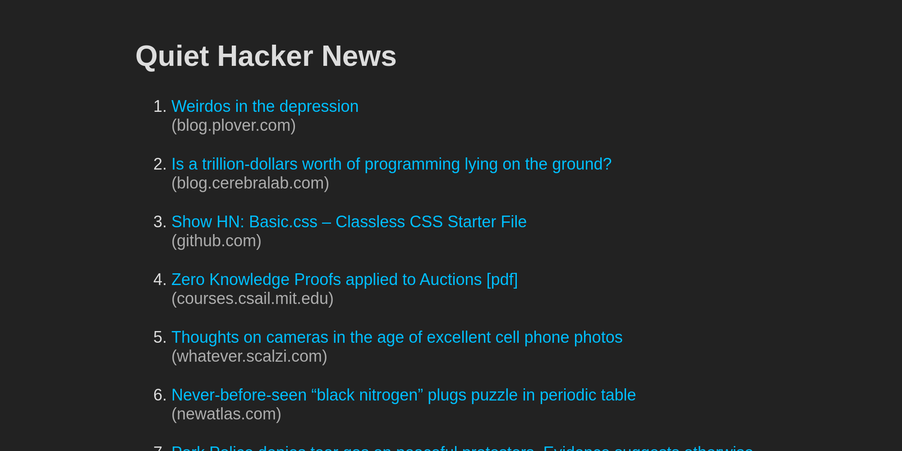

# [Quiet Hacker News](https://quiet-hacker-news.apps.ellington.io/)

<!-- aaronellington/stencil -->
  
<!-- aaronellington/stencil -->

A quieter approach to Hacker News. Links and nothing else.

## What is it?
- Just a list of the top 30 links from Hacker News
- Updates about once an hour

## Extra Features
- Uses `prefers-color-scheme` for light and dark mode
- Works well on small screens

## Usage
- From Source:
    - Build binary from source: `make`
    - Run for local development: `make dev`
    - See [Makefile](/Makefile) for additional targets
- From Docker Image:
    - `docker run -p 2222:2222 ghcr.io/aaronellington/quiet-hacker-news`
